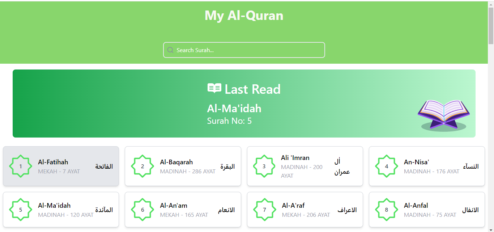
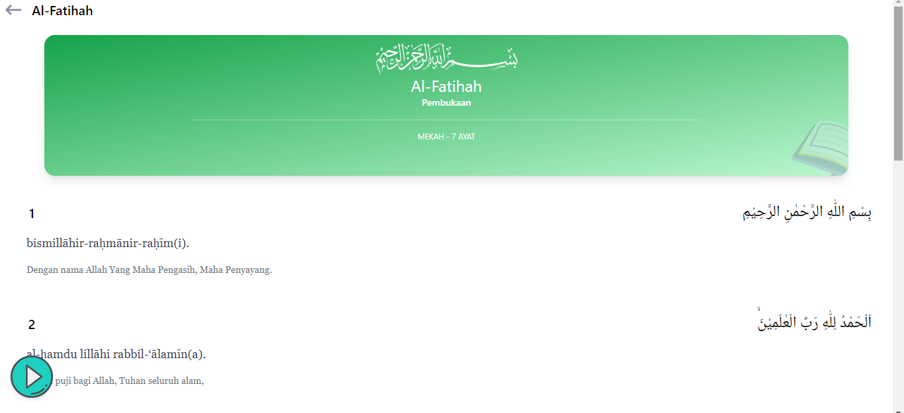
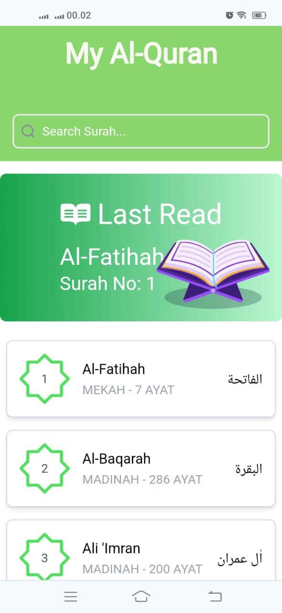
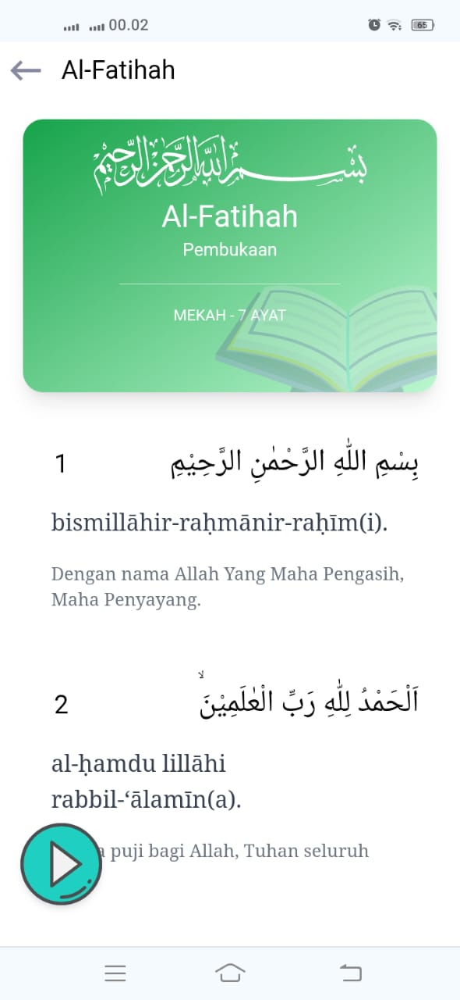
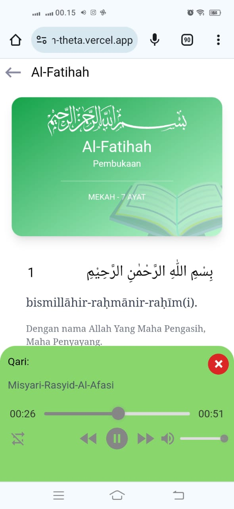

# My Quran

My Quran adalah aplikasi web yang dibuat dengan React.js dan Tailwind CSS, menggunakan API dari [equran.id](https://equran.id) untuk menampilkan Al-Qur'an lengkap dengan fitur murottal. Aplikasi ini dirancang untuk memberikan kemudahan dalam membaca dan mendengarkan ayat-ayat suci Al-Qur'an.

## Screenshoot

### Tampilan dekstop




#### Tampilan SmartPhone 






## Fitur

- **Menampilkan Surat Al-Qur'an Lengkap**: Pengguna dapat menelusuri dan membaca seluruh surat dalam Al-Qur'an.
- **Surat Terakhir Dibaca**: Aplikasi menyimpan surat terakhir yang dibaca oleh pengguna, sehingga pengguna dapat dengan mudah melanjutkan membaca.
- **Audio Murottal**: Setiap surat disertai dengan audio murottal yang dapat diputar langsung di aplikasi.

## Teknologi yang Digunakan

- **React.js**
- **Tailwind CSS**
- **equran.id API**

## Cara Menggunakan

1. Clone repositori ini:
    ```bash
    git clone https://github.com/Anjaszz/My-Quran.git
    ```
2. Masuk ke direktori proyek:
    ```bash
    cd My-Quran
    ```
3. Instal dependensi:
    ```bash
    npm install
    ```
4. Jalankan aplikasi di lingkungan pengembangan:
    ```bash
    npm run dev
    ```
5. Buka [http://localhost:5173](http://localhost:5173) di browser untuk melihat aplikasi.
